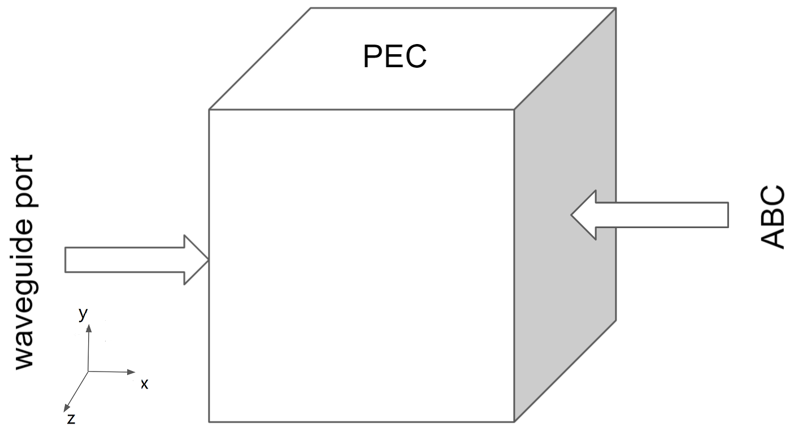
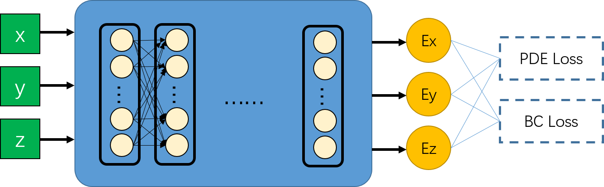
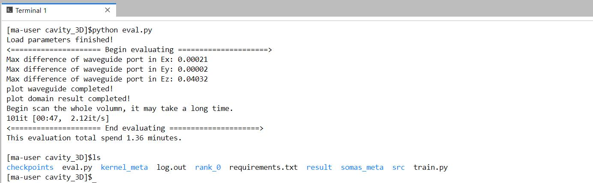
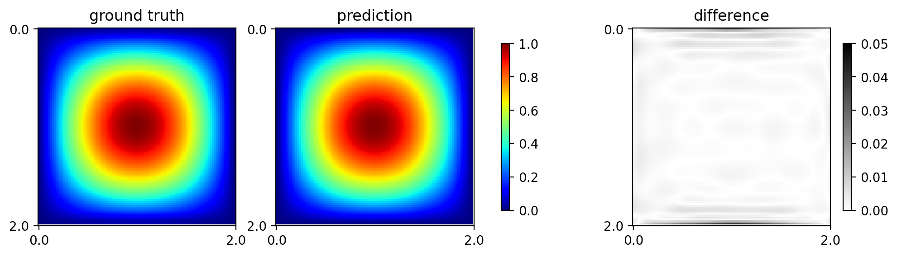
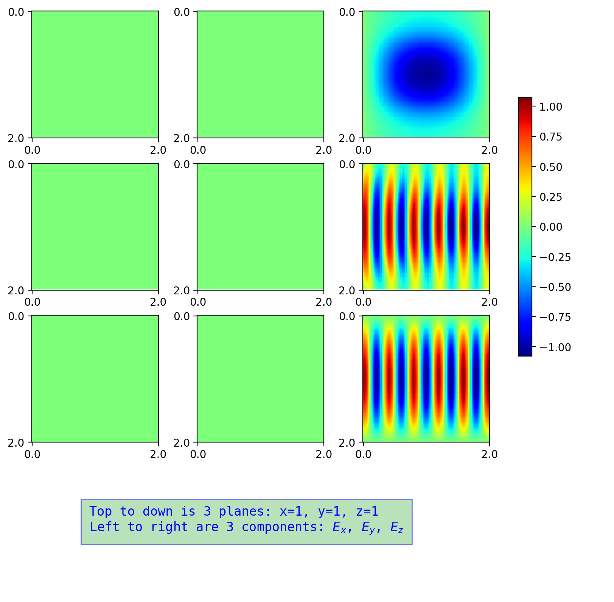

# 目录

# 模型名称

> PINN(Physical Informed Neural Network) 求解频域 3D Maxwell 方程：
> $$
> \nabla\times\nabla\times {E} + \epsilon_r k^2 {E} = 0
> $$
> 在立方体内部无源，因此有 
> $$
> \nabla \cdot {E} = 0
> $$
> 则可以化简得出
> $$
> \nabla^2 {E} + \epsilon_r k^2 {E} = {0}
> $$
> 仿真环境如图1所示：
> 
> 
> 
> 仿真的立方体长、宽、高尺寸均为 $2$，取立方体中心为坐标原点，向右、向上、向外分别为 $x,y,z$ 方向。
> - 四个环面（上、前、下、右）边界为 PEC（理想导体边界条件），右面为 ABC（吸收边界条件）。
> - PEC 边界条件方程为：
> $$
> {n}\times(\nabla\times{E})=0
> $$
> - ABC(Absorbing boundary condition，吸收边界条件)的边界方程为
> $$
> {n}\times{E}=0 \\
> \frac{\partial E_n}{\partial n} = 0
> $$

## 模型架构

> PDE方程求解的原理如下图所示：
> 
> 

> 采用 `mindelec.architecture` 提供的 `MultiScaleFCCell` 模型。采用多通道残差网络结合Sin激活函数的网络架构，其结构如图所示：
> 
> 

## 数据集

> 数据集包含2类：
> - 对立方体内部，使用 `mindelec` 定义的 `Cuboid` 采样，默认采用均匀网格划分，划分粒度为 $64\times 64 \times 64$ 。
> - 对立方体的4个PEC面和ABC面，使用 `mindelec` 定义的随机采样，采样点数默认为 `65536`。
> - 对波导管输入平面，数据采用 $E_x = 0, E_y = 0, E_z = sin(k_1 y) * sin(k_2 z)$ 的方式定义，其中 $k_1, k_2$ 为系数，项目中等价于 $k_1 = \pi, k_2 = \pi$。该输入参考 [Nvidia Modulus](https://docs.nvidia.com/deeplearning/modulus/user_guide/intermediate/em.html#problem-3-3d-waveguide-cavity) 的输入。


## 环境要求

> requirements.txt
> ```
> numpy
> matplotlib
> tqdm
> easydict
> mindspore>=1.5.0
> mindelec==0.1.0
> ```

## 快速入门

> 项目仅支持 Ascend平台。
> * 训练命令
> ```bash
> python train.py
> ```
> 说明：由于默认将日志打印到控制台，如果要保存成文本，可以使用 Linux 的管道及 `tee` 命令同时将输出保存到文件，例如保存到 `log.out`，则运行
> ```bash
> python train.py | tee log.out
> ```
> 
> - 推理命令
> ```bash
> python eval.py
> ```

## 脚本说明

### 脚本和样例代码

> ```python3
>    3D_waveguide_cavity/
>    |   eval.py                    # 评估模型脚本
>    |   README.md                  # 项目介绍
>    |   requirements.txt           # 所需Python库
>    |   train.py                   # 训练脚本
>    |
>    +---images/                    # README.md 中一些插图
>    |
>    \---src/                  
>            callback.py            # 回调函数
>            config.py              # 模型参数配置
>            dataset.py             # 生成数据集
>            maxwell.py             # Maxwell方程定义
> ```

### 脚本参数

> ```python
> # 在立方体中采样配置
> cuboid_sampling_config = ed({
>     'domain': ed({                   # 区域内采样
>         'random_sampling': False,    # 是否随机采样
>         'size': [64, 64, 64],        # 采样网格
>     }),
>     'BC': ed({                       # 边界点采样
>        'random_sampling': True,     # 是否随机采样
>         'size': 65536,               # 采样点数
>         'sampler': 'uniform',        # 均匀分布采样
>     })
> })
> 
> # 模型等config
> maxwell_3d_config = ed({
>    "name": "Maxwell3D",              # 模型名称
>    "geom_name": "cuboid",            # 几何体名称
>   
>    # 训练参数
>    "epochs": 3000,                   # 迭代epoch次数，建议 >=1000
>    "batch_size": 256,                # 训练batch_size
>    "lr": 0.001,                      # 训练学习率
>    "pretrained": False,              # 是否使用预训练模型，模型从 param_path加载。
>    "param_path": "checkpoints/model_cavity_best.ckpt", # 训练好的模型参数位置
>    
>   # 仿真环境参数
>    "coord_min": [0.0, 0.0, 0.0],     # xyz最小坐标值
>    "coord_max": [2.0, 2.0, 2.0],     # xyz最大坐标值
>    "eps0": 1.0,                      # 真空电导率
>    "wave_number": 16,                # 波数
>    "eigenmode": 1,                   # 特征模数
>    
>    # 神经网络参数
>    "in_channel": 3,                  # 输入通道数
>    "out_channel": 3,                 # 输出通道数
>    "layers": 6,                      # 重复次数
>    "neurons": 32,                    # 每层的神经元数量
>    
>    # 评估参数，其中训练好权重路径和训练参数param_path共用
>    "axis_size": 101,                 # 评估时网格划分密度
>    "result_save_dir": "result",      # 评估结果保存文件夹
>})
> ```

## 训练过程

### 训练

> 训练命令
```shell
python train.py | tee log.out
```

> 训练日志

```log
# grep log.out
epoch: 1 step: 1024, loss is 0.15519671142101288
epoch time: 351.3 s, per step time: 343.033 ms
Current epoch: 1, loss: 0.15519671142101288, saved checkpoint.
...
epoch: 2998 step: 1024, loss is 0.008034806698560715
epoch time:  16.7 s, per step time: 16.299 ms
epoch: 2999 step: 1024, loss is 0.0063581508584320545
epoch time:  16.7 s, per step time: 16.284 ms
epoch: 3000 step: 1024, loss is 0.025474904105067253
epoch time:  16.7 s, per step time: 16.282 ms
```

> 训练checkpoint将被保存在`checkpoints/`目录下，在回调函数中定义只有该epoch比上一个epoch的损失更小，则保存本epoch结束时的模型，否则不保存模型。


## 推理

### 推理过程

> 推理脚本

```bash
python eval.py
```

### 推理结果

> - 因为只有波导面有真实值，因此主要看波导面相对误差。波导管输入面结果（最大差值 $E_z = 0.04032$，其中波导面真实数据最大值为 $1.0$，则相对误差 `max(diff)/max(ground-truth)=4.03%`。而波导面的 $E_x, E_y$ 真实值应该均为0，预测值的最大值分别为 0.00021 和 0.00002，均很小）。验证截图如下：
> 
> 
> 
> - 波导管输入截面 $(x=0)$ 的真实值、预测值和差值如下图所示，其中仅有 $E_z$ 方向有输入，其他方向输入为0，因此此处给出 $E_z$ 方向)：
> 
> 
> 
> - 波导管在 $x=0$ 截面，该面上只有 $E_z$ 分量的电场，场强由前述训练数据给出。下图绘制出三个中心面，即 $x=1, y=1, z=1$ 三个面上的场强分布。从上到下分别是 $x=1, y=1, z=1$ 三个截面，从左到右分别是每个截面上的 $E_x, E_y, E_z$ 分量，从图中可以看出，$E_x, E_y$ 几乎为总 $0$，由于波数是 16,在长为 2 的区间内波数大约为 $ 16 / (2\pi) * 2 = 5.1$ 个周期正弦波，和图中第(2,3) 和 (3,3) 位置的波形吻合，验证了结果的正确性。
> 
> 


## 性能

### 训练性能

| Parameters                 | Ascend 910                                                   |
| -------------------------- | ------------------------------------------------------------ | 
| Model Version              | PINN Slab                                               |  
| Resource                   | Ascend: 1*Ascend 910, CPU: 24vCPUs 96GB | 
| uploaded Date              | 09/30/2022 (month/day/year)                                  | 
| MindSpore Version          | 1.15.1                                                        | 
| Dataset                    | 立方体内部、边界采样，使用公式计算波导管输入                           | 
| Training Parameters        | epoch=3000, steps per epoch=1024, batch_size =256              | 
| Optimizer                  | Adam                                                     | 
| Loss Function              | L2范数                                      | 
| outputs                    | 电场分量 $E_x$, $E_y$, $E_z$                               | 
| Loss                       | 0.075086                                                | 
| Speed                      | 18 s/epoch（第一个epoch耗时较长，约368秒）      | 
| Total time                 | 15 hours                                     | 
| Parameters (KB)            | 220 KB                                                         | 
| Scripts                    | [link](https://git.openi.org.cn/forcekeng/PINN_Maxwell3D)   |

### 推理性能

> 提供推理性能的详细描述，包括耗时，精度等

| Parameters          | Ascend                      |
| ------------------- | --------------------------- |
| Resource            | Ascend: 1*Ascend 910, CPU: 24vCPUs 96GB    |
| Uploaded Date       | 9/30/2022 (month/day/year) |
| MindSpore Version   | 1.15.1                       |
| Dataset             | 自定义数据集                 |
| outputs             | 电场分量 $E_x$, $E_y$, $E_z$                |
| Model for inference | 220KB (.ckpt)             |
| Total time                 | 1.33 Minutes                | 

## 参考资料
[Nvidia Modulus](https://docs.nvidia.com/deeplearning/modulus/text/intermediate/em.html#)

## 贡献指南

如果你想参与贡献昇思的工作当中，请阅读[昇思贡献指南](https://gitee.com/mindspore/models/blob/master/CONTRIBUTING_CN.md)和[how_to_contribute](https://gitee.com/mindspore/models/tree/master/how_to_contribute)

### 贡献者

此部分根据自己的情况进行更改，填写自己的院校和邮箱

* [耿力](https://git.openi.org.cn/forcekeng) (同济大学)
* e-mail: forcekeng@126.com

## ModelZoo 主页

请浏览官方[主页](https://gitee.com/mindspore/models)。
